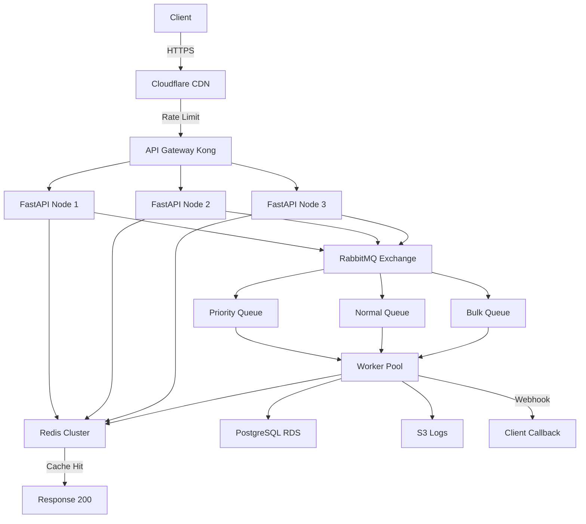

# Task B — Design for Scale: URL Audit Service

## Executive Summary

This document presents the system architecture for scaling the URL Audit Service from a single-node deployment to a production-grade platform capable of handling **10,000 audits/day** (~7 req/min average) with burst capacity for **500 concurrent requests**, while maintaining a customer-facing SLA for response time.

---

## 1. Architecture Overview

### 1.1 System Context

```
┌─────────────┐     ┌─────────────────┐     ┌─────────────────┐
│   Client    │────▶│  Cloudflare CDN │────▶│  API Gateway    │
│ (Web/Mobile)│     │ (DDoS + Cache)  │     │   (Kong/AWS)    │
└─────────────┘     └─────────────────┘     └─────────────────┘
                                                     │
                          ┌────────────────────────┼────────────────────────┐
                          │                        │                        │
                   ┌──────▼──────┐          ┌─────▼──────┐          ┌──────▼──────┐
                   │  API Node 1 │          │ API Node 2 │          │  API Node 3 │
                   │  (FastAPI)  │          │ (FastAPI)  │          │ (FastAPI)   │
                   │   (ECS)     │          │   (ECS)    │          │   (ECS)     │
                   └──────┬──────┘          └─────┬──────┘          └──────┬──────┘
                          │                       │                        │
                          └───────────────────────┼────────────────────────┘
                                                  │
                                         ┌────────▼────────┐
                                         │  Redis Cluster  │
                                         │  (ElastiCache)  │
                                         │  Cache + Lock   │
                                         └────────┬────────┘
                                                  │
                                         ┌────────▼────────┐
                                         │   RabbitMQ      │
                                         │ (3-node cluster)│
                                         │  DLX + Quorum   │
                                         └────────┬────────┘
                                                  │
                          ┌───────────────────────┼───────────────────────┐
                          │                       │                       │
                   ┌──────▼──────┐         ┌────▼─────┐          ┌──────▼──────┐
                   │  Worker 1   │         │ Worker 2 │          │  Worker N   │
                   │  (FastAPI)  │         │(FastAPI) │          │  (FastAPI)  │
                   │   (ECS)     │         │  (ECS)   │          │   (ECS)     │
                   └──────┬──────┘         └────┬─────┘          └──────┬──────┘
                          │                       │                        │
                          └───────────────────────┼────────────────────────┘
                                                  │
                                         ┌────────▼────────┐
                                         │  PostgreSQL     │
                                         │  (RDS Multi-AZ) │
                                         │  Audit Archive  │
                                         └─────────────────┘
                                                  │
                                         ┌────────▼────────┐
                                         │   S3 / GCS      │
                                         │  (Audit Logs)   │
                                         └─────────────────┘
```

### 1.2 Component Breakdown

| Layer | Component | Responsibility |
|-------|-----------|--------------|
| **Edge** | Cloudflare CDN | DDoS mitigation, edge caching, SSL termination |
| **Gateway** | Kong / AWS API Gateway | Rate limiting, auth, request routing, SSL |
| **API Layer** | FastAPI (ECS Fargate) | Request validation, cache lookup, enqueue jobs |
| **Cache** | Redis Cluster (ElastiCache) | Sub-ms cache reads, distributed locking, pub/sub |
| **Queue** | RabbitMQ Quorum Queues | Durable job queue, priority lanes, DLX for retries |
| **Workers** | FastAPI Workers (ECS Fargate) | Async HTTP auditing, result caching, DB writes |
| **Database** | PostgreSQL (RDS Multi-AZ) | Relational audit history, analytics queries |
| **Object Store** | S3 / GCS | Immutable raw audit logs, partitioned by date |

### 1.3 Data Flow

#### Happy Path (Cache Hit)
```
Client → CDN → API Gateway → API Node → Redis Cache → Response (X-Cache: HIT)
```
**Latency target:** < 50ms p99

#### Happy Path (Cache Miss)
```
Client → CDN → API Gateway → API Node → Redis (miss) → RabbitMQ → Worker → HTTP Audit → Redis (set) → PostgreSQL → Response (202 Accepted)
```
**Latency target:** < 2s p99 (async with webhook/polling)

#### Async Flow (Slow External Site)
```
Client → CDN → API Gateway → API Node → RabbitMQ → Worker → HTTP Audit (slow) → Webhook callback → Client
```

### 1.4 Where State Lives

| State Type | Storage | Reason |
|------------|---------|--------|
| **Active Cache** | Redis Cluster | Sub-millisecond access, TTL support, pub/sub invalidation |
| **Queue State** | RabbitMQ Quorum Queues | Durable, replicated, exactly-once semantics |
| **Audit History** | PostgreSQL (RDS) | Relational integrity, complex queries, ACID compliance |
| **Raw Logs** | S3 / GCS | Cheap, immutable, partitioned by date for analytics |
| **Config/Secrets** | AWS Secrets Manager | Encrypted, versioned, IAM-controlled |

---

## 2. Scaling Math

### 2.1 Load Analysis

| Metric | Value | Notes |
|--------|-------|-------|
| Daily audits | 10,000 | ~7 req/min average |
| Peak concurrent | 500 | Burst capacity needed |
| SLA response time | < 2s p99 | Customer-facing guarantee |
| Cache hit rate target | > 80% | Reduces external HTTP calls |
| Peak hours multiplier | 10x | Morning spikes possible |

### 2.2 Resource Sizing

| Component | Baseline | Peak (10x) | Notes |
|-----------|----------|------------|-------|
| API Nodes | 3 tasks | 20 tasks | ECS Fargate, auto-scaling |
| Workers | 5 tasks | 30 tasks | Separate from API nodes |
| Redis | cache.r6g.large | cache.r6g.xlarge | ElastiCache cluster mode |
| RabbitMQ | 3-node cluster | 5-node cluster | Quorum queues for HA |
| PostgreSQL | db.r6g.large | db.r6g.xlarge | Multi-AZ, read replicas |

---

## 3. Queueing Strategy

### 3.1 Why Async Queueing?

At 500 concurrent requests with 10K audits/day, synchronous processing is technically possible, but queues provide critical production benefits:

- **Decoupling**: API returns `202 Accepted` immediately; clients poll or use webhooks
- **Burst absorption**: Handle traffic spikes without rejecting requests
- **Retry logic**: Failed audits retry with exponential backoff
- **Priority lanes**: VIP customers get dedicated queues
- **Worker isolation**: Slow external sites don't block fast ones

### 3.2 Queue Design

| Queue | Purpose | TTL | Max Retries |
|-------|---------|-----|-------------|
| `audit.priority` | SLA-guaranteed customers | 2 min | 3 |
| `audit.normal` | Standard audits | 5 min | 3 |
| `audit.bulk` | Batch/low-priority jobs | 30 min | 1 |
| `audit.dlx` | Dead Letter Exchange | 24 hours | Manual |

### 3.3 Message Flow

```
API Node publishes → Exchange (topic: audit.*)
                          │
            ┌─────────────┼─────────────┐
            ▼             ▼             ▼
     [priority]     [normal]      [bulk]
            │             │             │
            └─────────────┴─────────────┘
                          │
                    Worker Pool
                          │
                    Success → Cache + DB
                    Failure → DLX (after 3 retries)
```

---

## 4. API Design for Scale

### 4.1 Synchronous Endpoint (Cached Results)

```
POST /api/v1/audit
```

**Behavior:**
- Cache hit → Returns `200 OK` immediately (< 50ms)
- Cache miss → Returns `202 Accepted` with `Location` header for polling

**Response (202):**
```json
{
  "job_id": "job_abc123",
  "status": "queued",
  "estimated_wait_ms": 1500,
  "poll_url": "/api/v1/jobs/job_abc123"
}
```

### 4.2 Polling Endpoint

```
GET /api/v1/jobs/{job_id}
```

**Response (pending):**
```json
{
  "job_id": "job_abc123",
  "status": "processing",
  "queue_position": 3
}
```

**Response (complete):**
```json
{
  "job_id": "job_abc123",
  "status": "completed",
  "result": { ... audit data ... }
}
```

### 4.3 Webhook Endpoint

```
POST /api/v1/audit
Body: { "url": "...", "webhook_url": "https://client.com/callback" }
```

Worker calls `webhook_url` with result when complete.

---

## 5. Caching Strategy at Scale

### 5.1 Multi-Tier Cache

```
┌─────────────┐     ┌─────────────┐     ┌─────────────┐
│  Browser    │────▶│   CDN Edge  │────▶│  Redis      │
│  (ETag)     │     │  (1 min)    │     │  (5 min)    │
└─────────────┘     └─────────────┘     └─────────────┘
```

### 5.2 Cache Invalidation

- **TTL-based**: Primary mechanism. Configurable per URL pattern.
- **Event-based**: Webhooks trigger cache purges for specific URLs.
- **Versioned keys**: `audit:v2:{url}` allows blue/green cache migrations.

### 5.3 Cache Warming

Background worker pre-populates cache for top 1,000 URLs every 5 minutes:
```python
# Pseudo-code for cache warmer
def warm_cache():
    top_urls = db.query("SELECT url FROM audits ORDER BY count DESC LIMIT 1000")
    for url in top_urls:
        if not cache.exists(url):
            queue.publish("audit.bulk", {"url": url, "priority": "low"})
```

---

## 6. Security at Scale

| Layer | Control |
|-------|---------|
| Edge | Cloudflare WAF, DDoS protection, Bot management |
| Gateway | API key auth, OAuth2, IP allowlisting |
| API | Input validation, SSRF protection (existing), request size limits |
| Network | VPC isolation, security groups, private subnets for DB/cache |
| Data | Encryption at rest (RDS/S3), TLS 1.3 in transit |

---

## 7. Deployment Architecture

### 7.1 Blue/Green Deployment

```
┌──────────────┐
│  Route 53    │── Weighted routing ──▶┌──────────┐ (100%)
│  (DNS)       │                       │  Blue    │  (stable)
└──────────────┘                       └──────────┘
         │
         └─────────────────────────────▶┌──────────┐ (0%)
                                      │  Green   │  (new version)
                                      └──────────┘
```

**Rollout:** 0% → 10% → 50% → 100% over 10 minutes
**Rollback:** Instant DNS flip back to stable color

### 7.2 Infrastructure as Code

```
terraform/
├── modules/
│   ├── ecs/           # API + Worker services
│   ├── redis/         # ElastiCache cluster
│   ├── rds/           # PostgreSQL Multi-AZ
│   ├── rabbitmq/      # MQ cluster
│   └── s3/            # Log storage
├── environments/
│   ├── staging/
│   └── production/
└── main.tf
```

---

## 8. Cost Estimates (Monthly)

| Component | Service | Cost (USD) |
|-----------|---------|------------|
| API + Workers | ECS Fargate (3 tasks baseline) | $150 |
| Cache | ElastiCache Redis (cache.t3.medium) | $50 |
| Queue | Amazon MQ (RabbitMQ, 3 nodes) | $200 |
| Database | RDS PostgreSQL (db.t3.medium, Multi-AZ) | $100 |
| Object Store | S3 (10GB logs) | $5 |
| CDN | Cloudflare Pro | $20 |
| **Total** | | **~$525/mo** |

---

## 9. Assumptions & Constraints

1. **External sites are the bottleneck**: 90% of latency comes from target websites, not our infrastructure.
2. **Idempotency**: Same URL audit returns identical result within cache window.
3. **Eventual consistency**: Cache may be stale for up to TTL duration (configurable).
4. **No persistent queue state needed**: If RabbitMQ fails, in-flight jobs are lost (acceptable for audit service; critical jobs use DLX).
5. **Read-heavy workload**: 80% cache hit rate means only 20% hit external sites.

---

## 10. Appendix: Mermaid Diagram


